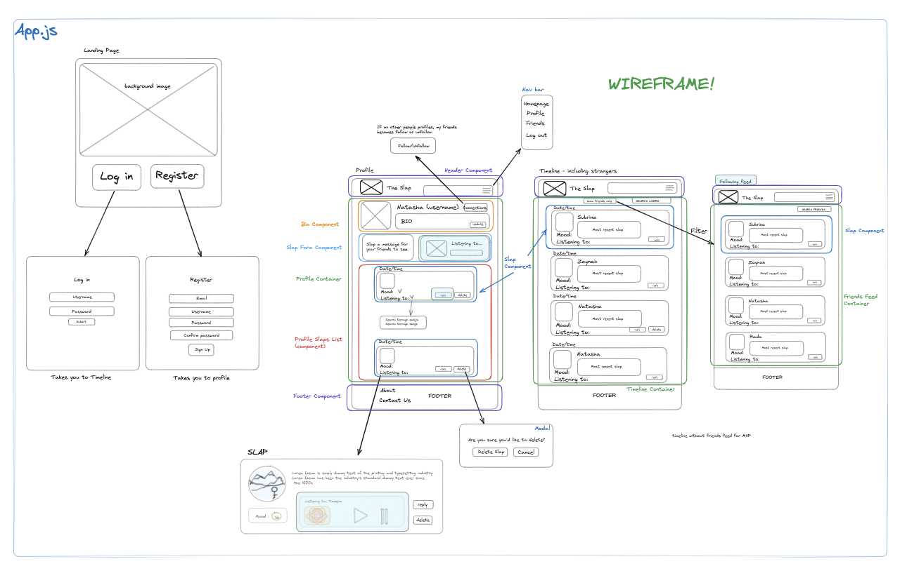

# The Slap (Client-side)

## **TABLE OF CONTENTS** 📖

> 1. Project Overview
> 2. Diagrams
> 3. Tech Stack
> 4. Set-Up Instructions
> 5. Future Developments
> 6. Collaborators

### **_1. Project Overview_**
As part of our capstone project, our team created an API and the UI for the app in 10 days. Our group decided to build on the nostalgic social media platform 'TheSlap.com' as seen on the show Victorious. The Slap is a modern social media platform reminiscent of MySpace, designed with the user in mind to share their thoughts and feelings with the world.

### **_2. Diagrams_**

#### Wireframe 

#### Component diagram

### **_3. Tech Stack_**

* JavaScript
* JSX
* React
* React Router

### **_4. Set-Up Instructions_**
#### The server-side API can be found [here](https://github.com/R08K09/Capstone_Slap_Server)
> Please follow the set-up instructions for the server-side first

Ensure the following is installed on your machine:

- Visual Studio Code

1. Install node modules - in your terminal, perform the following command: `npm install` or `npm i`
   
> NOTE: `npm install`/ `npm i` should also install react-icons, emoji-mart, and react-router. If it does not, please follow steps 2, 3, and 4. If the node modules are installed correctly, continue to step 5.

2. Install React Icons - in your terminal, perform the following command: `npm install react-icons`

3. Install React Slick - in your terminal, perform the following command: `npm install emoji-mart`

4. Install React Router - in your terminal, perform the following command: `npm install react-router`

5. Run the React App - in your terminal, perform the following command: `npm start`. The app should automatically open in your default browser. If it does not, you can manually navigate to http://localhost:3000 using your preferred browser.
   
6. Enjoy viewing our full-stack app!

### **_5. Future Devlopments_**

1. Enable light/dark mode functionality
2. Use WebSockets to allow different users to interact and allow for better scalability
3. Utilise a database (such as AWS) to store songs, videos and pictures

### **_6. Collaborators_**

* GitHub: [Nasthasia Usoh](https://github.com/nasthasiausoh)
* GitHub: [Rada Kanchananupradit](https://github.com/R08K09)
* GitHub: [Subrina Faisal](https://github.com/Subrina7)
* GitHub: [Zaynah Sadiq](https://github.com/Zaynah99)

